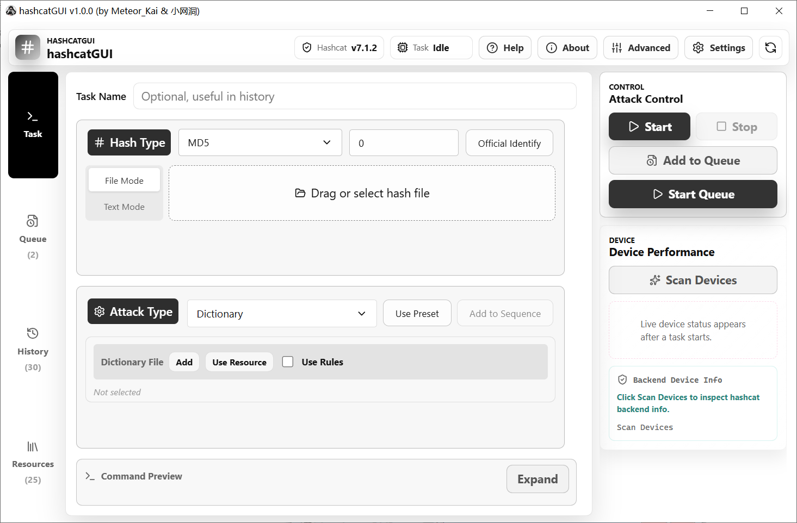
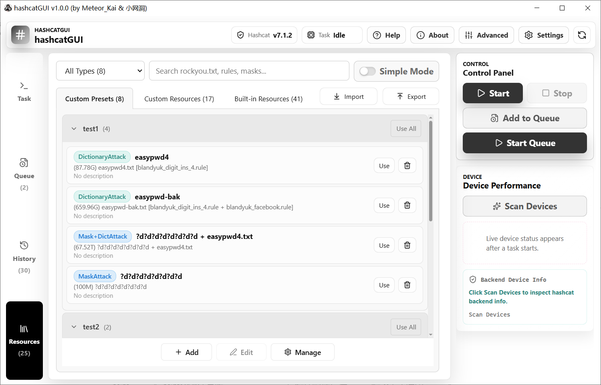

# hashcatGUI

[[ 中文 ]](https://github.com/wangdong0/hashcatGUI/blob/main/README_CN.md) | [[ English ]](https://github.com/wangdong0/hashcatGUI)

     

<p align="center">    </p>

**HashcatGUI** is a graphical interface tool for Hashcat on Windows. Built on the Tauri framework, it facilitates configuring, executing, and managing Hashcat tasks.

> [!NOTE]
>
> **HashcatGUI** may only be used for authorized security testing, password recovery, teaching and educational research. Any use targeting unauthorized systems, accounts or data is prohibited.

------






## 1. Introduction

### Quick Start

Download hashcatGUI from [Release](https://github.com/wangdong0/hashcatGUI/releases) for use.

The **hashcatGUI+hcxtools+hashcat.7z** archive comes bundled with hcxtools (for converting cap files to the hc22000 format) and hashcat; simply extract and use.

If you do not require the hc22000 conversion function and already have hashcat installed on your computer, you may download and run **hashcatGUI.exe** directly.

> [!IMPORTANT]
>
> **Win7 users need to install [VxKex](https://github.com/wangdong0/hashcatGUI/releases/download/Dependence/KexSetup_1.1.5_1679.exe) (to solve the ProcessPrng issue) and [MicrosoftEdgeWebView2Runtime](https://github.com/wangdong0/hashcatGUI/releases/download/Dependence/MicrosoftEdgeWebView2RuntimeInstallerX64.exe) (a dependency for program operation).**

1. Install **[VxKex](https://github.com/wangdong0/hashcatGUI/releases/download/Dependence/KexSetup_1.1.5_1679.exe)** (https://github.com/i486/VxKex). After installation, right-click on **hashcatGUI.exe**, select "Properties", and enable VxKex in the "VxKex" tab.

   

2. Install **[Microsoft Edge WebView2 Runtime](https://github.com/wangdong0/hashcatGUI/releases/download/Dependence/MicrosoftEdgeWebView2RuntimeInstallerX64.exe)**, complete the installation, and then launch hashcatGUI.exe.

### Main functions

This project is forked and further developed from [https://github.com/MeteorKai/hashcatGUI](https://link.wtturl.cn/?target=https%3A%2F%2Fgithub.com%2FMeteorKai%2FhashcatGUI&scene=im&aid=497858&lang=zh).

We have optimized the user interface and partial program logic, as well as enriched the functionalities based on the original repository.

- Supports input of hash text and hash files.
- Automatically identifies and converts WPA-format hashes (cap, pcap, pcapng, hccapx → hc22000), and parses ESSID and BSSID.
- Supported attack modes: Dictionary attack (0), Combinator attack (1), Mask attack (3), Dictionary + Mask attack (6, 7), and template candidates.
- Supports multiple attack modes running concurrently, automatic password count calculation, and a built-in rule editor.
- Supports CPU/GPU device selection, load configuration, and monitoring of runtime speed and temperature status.
  Features task queue for sequential execution of multiple tasks. Successfully cracked identical hashes will be skipped. 
- Supports queue adjustment, task suspension and progress resumption.
- Supports cached task history logs, password copying and result export.
- Supports custom attack presets and resources, with group management and search functions. Import and export of presets and resources are available.
- Compatible with OpenAI interfaces for hash consultation and task log analysis.


## 2. Development

### Directory Instructions

```text
src/                         React front-end code
src-tauri/                   Tauri / Rust backend code
scripts/                     Packing script
dist-portable/               Complete portable version output directory
```

### Development environment

> You need to install first: **Node.js, pnpm, Rust, and the Windows build dependencies required for Tauri 2**
>

- Install dependencies:

```powershell
pnpm install
```

- Initiate front-end development services:

```powershell
pnpm dev
```

- Activate Tauri development mode:

```powershell
pnpm tauri dev
```

### Build

- Build front-end:

```powershell
pnpm build
```

- Build a complete portable version:

```powershell
pnpm portable
```

- Output location of the complete portable version:

```text
dist-portable/hashcatGUI/hashcatGUI.exe
```


## 3. Disclaimers

> [!WARNING]
>
> - This tool is intended solely for authorized security testing, password recovery, teaching and academic research.
>- Do not use this tool against unauthorized systems, accounts or data. Users shall independently verify that their actions comply with local laws and regulations and the authorization scope of target systems.
> - The developers of this tool shall not be liable for any unauthorized use, data loss or associated legal risks.