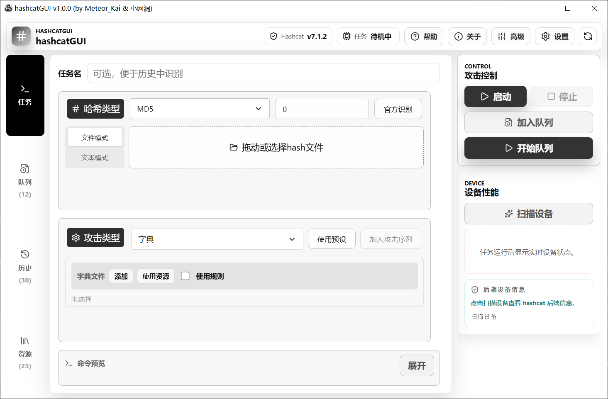
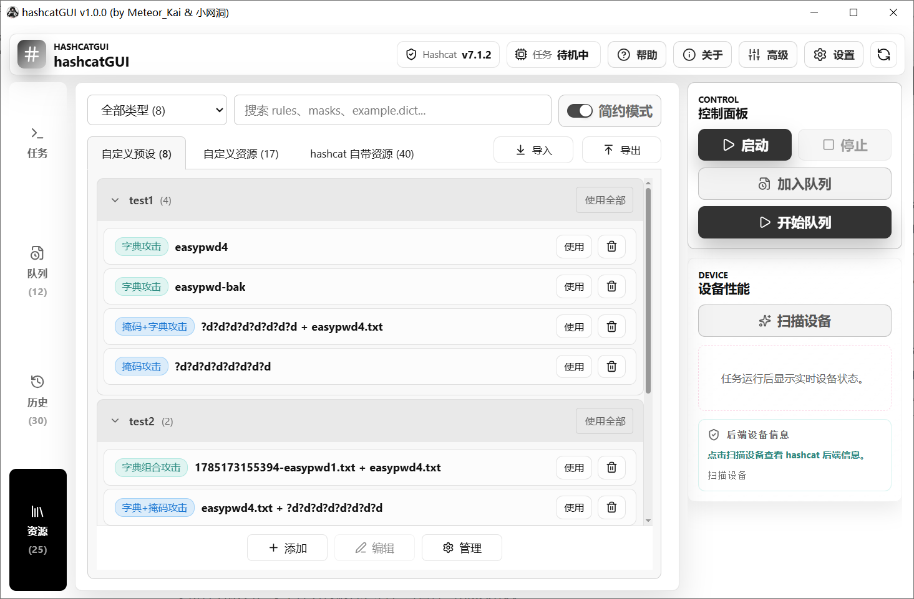
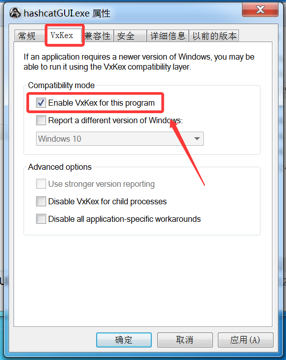

#  hashcatGUI

[[ 中文 ]](https://github.com/wangdong0/hashcatGUI/blob/main/README_CN.md) | [[ English ]](https://github.com/wangdong0/hashcatGUI)

     

<p align="center">    </p>

**hashcatGUI** 是一个面向 Windows 的 hashcat 图形界面工具，基于 Tauri 框架，可方便地配置、运行和管理 hashcat 任务。

> [!NOTE] **hashcatGUI** 仅用于授权安全测试、密码恢复、教学与学习研究。请勿在未授权的系统、账号或数据上使用。

------






## 1. 介绍

### 快速上手

在 [Release](https://github.com/wangdong0/hashcatGUI/releases) 中下载hashcatGUI使用。

**hashcatGUI+hcxtools+hashcat.7z ** 压缩包中内置了 hcxtools（用于将 cap 转换为 hc22000 格式）和 hashcat程序 ，解压即用。

若不需要 hc22000 转换功能，且您的电脑上已有 hashcat 程序，可直接下载 **hashcatGUI.exe** 使用。

> [!IMPORTANT]
>
> **Win7 用户需安装[VxKex](https://github.com/wangdong0/hashcatGUI/releases/download/Dependence/KexSetup_1.1.5_1679.exe)（解决ProcessPrng问题）和[MicrosoftEdgeWebView2Runtime](https://github.com/wangdong0/hashcatGUI/releases/download/Dependence/MicrosoftEdgeWebView2RuntimeInstallerX64.exe)（程序运行依赖）。**

1. 安装 [**VxKex**](https://github.com/wangdong0/hashcatGUI/releases/download/Dependence/KexSetup_1.1.5_1679.exe) 。安装完成并右键hashcatGUI.exe，选择属性，在VxKex选项卡中启用VxKex。

   

2. 安装 **[MicrosoftEdgeWebView2Runtime](https://github.com/wangdong0/hashcatGUI/releases/download/Dependence/MicrosoftEdgeWebView2RuntimeInstallerX64.exe)** ，安装完成，启动hashcatGUI.exe。

### 主要功能

本项目基于 https://github.com/MeteorKai/hashcatGUI 进行二次开发。

在原项目基础上优化了界面UI与部分逻辑，完善了软件功能。

- 支持 Hash 文本与 Hash 文件输入。
- 自动识别转换WPA格式哈希（cap、pcap、pcapng、hccapx → hc22000），ESSID、BSSID解析。
- 支持攻击模式：字典攻击(0)、字典组合(1)、掩码攻击(3)、字典掩码组合（6、7）、模板候选。
- 支持多种攻击模式同时使用，自动计算密码量，内置规则编辑器。
- 支持 CPU/GPU 设备选择、负载配置和运行速度、温度状态查看。
- 支持任务队列，多个任务按顺序运行，破解成功跳过相同 Hash。
- 支持队列调整、任务暂停与进度恢复。
- 支持任务历史日志缓存，密码复制，结果导出。
- 支持自定义攻击预设与资源，引入分组管理与搜索机制，支持预设与资源的导入导出。
- 支持 OpenAI 兼容接口，用于 Hash 咨询和任务日志分析。


## 2. 开发

### 目录说明

```text
src/                         React 前端代码
src-tauri/                   Tauri / Rust 后端代码
scripts/                     打包脚本
dist-portable/               完整便携版输出目录
```

### 开发环境

> 需要先安装：**Node.js，pnpm，Rust，Tauri 2 所需的 Windows 构建依赖**
>

- 安装依赖：

```powershell
pnpm install
```

- 启动前端开发服务：

```powershell
pnpm dev
```

- 启动 Tauri 开发模式：

```powershell
pnpm tauri dev
```

### 构建

- 构建前端：

```powershell
pnpm build
```

- 构建完整便携版：

```powershell
pnpm portable
```

- 完整便携版输出位置：

```text
dist-portable/hashcatGUI/hashcatGUI.exe
```


## 3. 免责声明

> [!WARNING]
>
> - 本工具仅用于授权安全测试、密码恢复、教学与学习研究。
>
> - 请勿在未授权的系统、账号或数据上使用本工具。使用者应自行确认自己的行为符合所在地法律法规和目标系统授权范围。
>
> - 本工具开发者不对任何未授权使用、数据损失或法律风险承担责任。